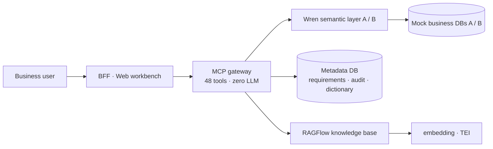

# Askoda · Intelligent Data Requirement Assistant

> **[中文](README.md) | English**

<p align="center">
  <b>Turn one sentence of business language into a well-calibrated, explainable, auditable analysis</b><br/>
  <sub>Ontology-driven · Intent-to-Analytics</sub>
</p>

<p align="center">
  <a href="#the-problem">The Problem</a> ·
  <a href="#core-features">Features</a> ·
  <a href="#quick-start">Quick Start</a> ·
  <a href="#architecture">Architecture</a> ·
  <a href="#documentation">Docs</a> ·
  <a href="#roadmap">Roadmap</a> ·
  <a href="#contributing">Contributing</a> ·
  <a href="#license">License</a>
</p>

---

## The Problem

When a business team asks for data, this is what usually happens:

> "Show me last month's sales per square meter by store" → the analyst asks
> "How do you define sales per square meter?" → the business answers "By floor area" →
> the analyst writes SQL, gets it reviewed, iterates three times → a number comes out,
> but **nobody can explain how that number was produced.**

<p align="center">

**Askoda records every step of this chain — and requires evidence at every step.**

</p>

It is not "yet another AI-BI". The difference is in the **outer two stages**:

| | Generic AI-BI | Askoda |
|---|---|---|
| **Before the question** | Guesses the definition | **Queries the knowledge base** first: definitions, fields, sensitive data |
| **Definition unclear** | Silently falls back to a default | **Returns a clarifying question, or refuses outright** |
| **After generating SQL** | Executes directly | **Five gates**: syntax / static rules / read-only / semantic dry-run / result assertions |
| **After the result** | A number | **Compliance audit**: replay the full judgment chain by version |

> "How was this sentence understood → which table was used → where the definition came from →
> what did each gate block → who executed what, when → why was this result deemed deliverable"
> — this chain is recorded every single time, and is replayable.

**It would rather fail to answer than make something up.** When a definition is vague,
a one-to-many join inflates the number, a field is unmodeled, or a metric is unconfirmed,
it asks follow-ups or refuses. It never silently defaults. That is exactly the bar
for production use inside an enterprise.

---

## Core Features

<table>
<tr><td width="50%" valign="top">

**① Knowledge base (upstream)**

Upload a definition document — no code changes

- Upload → auto-parse → semantic retrieval
- Every citation carries **document name + chunk ID + coordinates**, traceable to source
- One definition lives once (same-name uploads are rejected — two versions can't coexist)

</td><td width="50%" valign="top">

**② Requirement understanding**

Natural language → evidence-backed slots

- Every slot carries `evidence` + `confidence`; **slots without a stated basis fail validation**
- Conflicting definitions are never silently resolved — reported as "needs business confirmation"
- Unmodeled intent is **refused on miss**, never invented

</td></tr>
<tr><td valign="top">

**③ Constrained execution**

Five gates block risk before execution

- L1 syntax → L2 AST static rules → L3 read-only → L4 semantic dry-run → L5 result assertions
- `DELETE` / `INSERT` / multi-statement are blocked at L3
- Zero tolerance for writes — all generated SQL executes read-only

</td><td valign="top">

**④ Compliance audit (downstream)**

Full replay by version

- Snapshots of requirement / SQL / gate results / knowledge citations
- Requirements, analysis rounds, confirmation answers, fetch records all retained
- Queryable, exportable, attributable

</td></tr>
</table>

<p align="center">

**Shape**: 48 MCP tools · one streamable-http endpoint · five-menu web workbench ·
gateway makes **zero LLM calls** (deterministic planner, reproducible)

</p>

---

## Quick Start

**Only prerequisite**: Docker (OrbStack / Docker Desktop) + `docker compose` v2.

```bash
git clone <repo-url> && cd askoda
cp .env.example .env      # fill in 2 required values (see below)
docker compose up -d --build
```

<p align="center">

<b>→ Open <code>http://127.0.0.1:18081/</code> in your browser</b>

</p>

First run takes roughly 1–3 minutes (including build). Readiness check:

```bash
curl -s http://127.0.0.1:18081/api/v1/health | python3 -m json.tool
# status: ok, with A/B datasets and the metadata DB all ok: true
```

<details>
<summary><b>⚠️ Two required settings (knowledge retrieval fails without them)</b></summary>

| Variable | Meaning |
|---|---|
| `KNOWLEDGE_API_KEY` | API key issued by RAGFlow |
| `KNOWLEDGE_DATASET_ID` | Target dataset ID (must be a matched pair with the key) |

Create the dataset and generate an API key in the RAGFlow UI, then fill these in.
Leaving them empty makes the gateway **fail fast at startup** — this is deliberate,
so that "retrieval always returns empty" can never be mistaken for normal behavior.

</details>

<details>
<summary><b>Code changes not taking effect?</b></summary>

Python code is **baked into the image**; only MDL files are mounted. So:

```bash
docker compose up -d --build gateway bff   # ✅ correct
docker compose restart gateway            # ❌ still the old code
```

This is the single most common cause of "I changed it and nothing happened".

</details>

**Full instructions** → [Deployment Manual](docs/DEPLOYMENT.md) *(Chinese)*

---

## Architecture



<p align="center">

**Four stages**: ① Knowledge base (upstream) → ② Requirement understanding →
③ Constrained execution → ④ Compliance audit (downstream)

</p>

### Five architecture red lines

| # | Red line |
|---|---|
| R1 | Never expose an upstream open-source UI to business users |
| R2 | The frontend calls only our own BFF, never a backend directly |
| R3 | No forking, no modifying upstream (Wren / RAGFlow) |
| R4 | No UI patching / DOM injection |
| R5 | API contracts are versioned (uniform `/api/v1`) |

**One implementation discipline on top of these**: a tool's **parameter names and
order are a positional contract**. Renaming or reordering breaks every published caller.
Adding is fine; renaming is not.

<p align="center">

<a href="docs/DEPLOYMENT.md">→ Per-OS deployment guide (Windows / macOS / Linux), open-source inventory, troubleshooting</a>

</p>

---

## Documentation

<p align="center">

All documents below are written in Chinese.

| Document | Contents | Read it when |
|---|---|---|
| [**Deployment Manual**](docs/DEPLOYMENT.md) | Per-OS steps (Windows/macOS/Linux), open-source inventory, troubleshooting | **Before deploying on a new machine** |
| [MCP Tools Reference](docs/MCP_TOOLS.md) | All 48 tools documented + walkthroughs | Integrating an agent / calling tools |
| [Verification](docs/VERIFICATION.md) | Four gate layers, acceptance scripts, pre-demo reset | Before sign-off |
| [Dependencies & Limits](docs/DEPENDENCIES.md) | embedding, knowledge base, **known risks** | When a capability goes fully dark |
| [Milestones](docs/MILESTONES.md) | Completed stages, acceptance records, tech debt | Understanding project progress |
| [Demo Guide](docs/DEMO_GUIDE.md) | Nine-step demo flow with data checkpoints | Demoing to someone |
| [Glossary](docs/GLOSSARY.md) | MDL / BFF / P1–P9 / R1–R7 / G0–G3 | When a doc confuses you |
| [Gateway Internals](gateway/README.md) | Gateway structure, environment variables | Changing gateway code |

</p>

<p align="center">

⚠️ <b>This project has four numbering systems that share names but not meanings</b>:
<code>R1–R5</code> architecture red lines · <code>R1–R7</code> requirement semantic rules ·
<code>P1–P9</code> evidence levels · <code>G0–G3</code> gate layers.
Always spell out which one you mean.

</p>

---

## Project Status

<p align="center">

**Current stage: MVP delivery (development & testing)**

</p>

- Four-stage chain runs end to end, 48 tools available
- Gates **64/64 green**: G0 static 52 · G1 unit 8 · G2 independent review 2 · G3 live chain 2
  (day-to-day runs G0/G1 only — 60 items)
- Two mock business datasets: A e-commerce (6 models) · B retail membership (8 models, 48 fields)

<p align="center">

<b>⚠️ Security boundary — please read</b>

</p>

> **This system listens only on the loopback address and has no inbound authentication
> and no multi-tenant isolation** — anyone who can reach the port can query every
> requirement, every fetch record, and the entire knowledge base.
>
> **Use it only on a local machine in development/testing.**
> **Do not expose port 18081 to the public internet or an untrusted LAN.**
>
> This is a deliberate trade-off for MVP integration simplicity, not an oversight.
> Authentication and multi-tenancy are scheduled before production.

Full risk list: [Dependencies & Limits](docs/DEPENDENCIES.md).

---

## Roadmap

| Stage | Goal |
|---|---|
| **Current · MVP** | Complete the four-stage chain, demoable and acceptance-ready |
| v0.4 | Interaction & UI refinement, OBDA (table schema ↔ semantic layer auto-mapping) |
| v0.5 | Triple store + SPARQL + reasoning, ontology editing |
| v1.0 | Production-grade: authentication, multi-tenancy, high availability |

> Detailed plan: [Milestones](docs/MILESTONES.md). Subsequent stages follow the
> corresponding EKOS product-line path.

---

## Contributing

Read the [Contributing Guide](CONTRIBUTING.md) first (commit conventions, hard constraints, the 3-step acceptance method).

<p align="center">

Always run the gates before pushing:

</p>

```bash
python3 tools/gate_all.py --layers G0,G1    # day-to-day, these two layers only
python3 tools/gate_all.py                   # full (includes G3, hits the real DB)
```

**Exit code is the verdict**: `0` all green; non-`0` means red items — see `gate-report.md`.

<p align="center">

For security issues, see the <a href="#security-disclosure">Security Disclosure</a> policy below.
<strong>Please do not open a public issue.</strong>

</p>

---

## Security Disclosure

Please **contact the maintainer privately first**; do not open a public issue.

- Include: affected version, reproduction steps, scope of impact
- Fixes ship in the next release after confirmation, with credit in this section

The current form targets local development only, so the exposure surface is limited —
but **zero authentication** means **any local process can reach all data**.
Do not deploy it in an untrusted environment.

---

## License

Code is licensed under the **MIT License** — see [LICENSE](LICENSE).
Documentation is licensed under **CC BY 4.0**; please attribute.

<p align="center">

| Third-party component | License | Integration |
|---|---|---|
| [FastMCP](https://github.com/jlowin/fastmcp) | MIT | Python dependency |
| [sqlglot](https://github.com/tobymao/sqlglot) | MIT | Python dependency (SQL parsing) |
| [Wren Engine Ibis](https://github.com/Canner/wren-engine) | Apache-2.0 | Separate container, MCP protocol |
| [PostgreSQL](https://www.postgresql.org) | PostgreSQL License | Separate container |
| [MinIO](https://github.com/minio/minio) | AGPL-3.0 | Separate container (standalone service, not linked to this code) |
| [RAGFlow](https://github.com/infiniflow/ragflow) | Apache-2.0 | Separate stack, HTTP client |

</p>

<p align="center">

<strong>Acknowledgements</strong>: semantic layer capability is provided by
<a href="https://github.com/Canner/wren-engine">Wren Engine</a>; the knowledge base by
<a href="https://github.com/infiniflow/ragflow">RAGFlow</a>. Both are integrated as
independent processes over standard protocols, with <strong>no fork and no upstream
modifications</strong>.

</p>