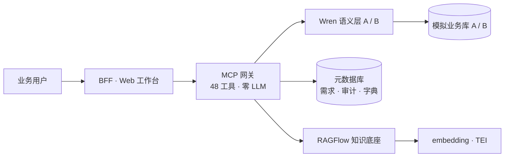

# Askoda · 数据需求智能分析助手

> **[English](README.en.md) | 简体中文**

<p align="center">
  <b>用一句业务话，得到口径明确、可解释、可审计的分析结果</b><br/>
  <sub>本体驱动 · Ontology-Driven Intent-to-Analytics</sub>
</p>

<p align="center">
  <a href="#它解决什么问题">它解决什么问题</a> ·
  <a href="#核心特性">核心特性</a> ·
  <a href="#快速开始">快速开始</a> ·
  <a href="#架构">架构</a> ·
  <a href="#文档">文档</a> ·
  <a href="#路线图">路线图</a> ·
  <a href="#贡献">贡献</a> ·
  <a href="#许可证">许可证</a>
</p>

---

## 它解决什么问题

业务提一个数据需求，走完通常是这么一条路：

> 「帮我看下上个月各门店的坪效」 → 数据同学问「坪效怎么算？」→ 业务答「按营业面积」→
> 数据同学翻语义层、写 SQL、被 review、改三轮 → 跑出来一个数，但没人说得清这个数是怎么来的。

<p align="center">

**Askoda 把这条链路的每一步都留下来，并且每一步都要有据可依。**

</p>

它不是「又一个 AI 问数」。核心差别在**首尾两段**：

| | 通用 AI-BI | Askoda |
|---|---|---|
| **问之前** | 直接猜口径 | **先查知识底座**：口径、字段、敏感数据都在库里 |
| **口径不明时** | 静默用默认值兜底 | **返回澄清问题，或直接拒绝** |
| **生成 SQL 后** | 直接执行 | **五层门禁**：语法 / 静态规则 / 只读 / 语义预演 / 结果断言 |
| **出数之后** | 一个结果 | **合规审计**：按版本完整回放当时的判断链 |

> 「这句话是怎么被理解的 → 用了哪张表 → 口径从哪来 → 每一道门禁拦了什么 →
> 谁在什么时候执行过 → 结果为什么被判为可交付」—— 这条链每次都留痕，可回放。

**它宁可答不出来，也不糊弄你。** 对口径模糊、一对多放大、未建模字段、未确认指标，
它会追问或拒答，不用默认值静默兜底。这正是它能进企业生产的门槛。

---

## 核心特性

<table>
<tr><td width="50%" valign="top">

**① 知识底座（前置）**

口径文档上传即可用，不改一行代码

- 文档上传 → 自动解析 → 语义检索命中
- 每条引用带**文档名 + chunk ID + 坐标**，可追溯到原文
- 同一口径只留一份（同名文件会被拦下，不让两版口径并存）

</td><td width="50%" valign="top">

**② 需求理解**

自然语言 → 带证据的槽位

- 每个槽位都带 `evidence` + `confidence`，**说不出依据的过不了校验**
- 冲突口径不静默择一，按规则报「需业务确认」
- 未建模意图**未命中即拒**，不编造

</td></tr>
<tr><td valign="top">

**③ 受控执行**

五层门禁把风险挡在执行之前

- L1 语法 → L2 AST 静态规则 → L3 只读 → L4 语义层预演 → L5 结果断言
- `DELETE` / `INSERT` / 多语句在 L3 直接拦截
- 写操作零容忍，生成的 SQL 一律只读执行

</td><td valign="top">

**④ 合规审计（后置）**

按版本完整回放

- 需求 / SQL / 门禁结果 / 知识引用全链快照
- 需求单、分析轮次、确认答复、取数记录全部留痕
- 可查可导出可追责

</td></tr>
</table>

<p align="center">

**技术形态**：48 个 MCP 工具 · 一个 streamable-http 端点 · 五菜单 Web 工作台
· 网关**零 LLM 调用**（确定性规划器，可复现）

</p>

---

## 快速开始

**唯一前置**：Docker（OrbStack / Docker Desktop）+ `docker compose` v2。

```bash
git clone <repo-url> && cd askoda
cp .env.example .env      # 按注释填 2 项必填（见下）
docker compose up -d --build
```

<p align="center">

<b>→ 浏览器打开 <code>http://127.0.0.1:18081/</code></b>

</p>

首次约 1–3 分钟（含构建）。就绪判据：

```bash
curl -s http://127.0.0.1:18081/api/v1/health | python3 -m json.tool
# status: ok，且 A/B 双库与元数据库均 ok: true
```

<details>
<summary><b>⚠️ 两项必填配置（不填则知识检索不可用）</b></summary>

| 变量 | 说明 |
|---|---|
| `KNOWLEDGE_API_KEY` | RAGFlow 侧的 API Key |
| `KNOWLEDGE_DATASET_ID` | 目标数据集 ID（与 Key 必须成对且同属一个数据集） |

取值方式：在 RAGFlow 界面建好数据集并生成 API Key 后回填。
留空会导致网关启动即硬失败——这是刻意设计，避免「检索恒为空」被误当成正常。

</details>

<details>
<summary><b>改了代码不生效？</b></summary>

Python 代码**打进镜像**，容器只挂载了 MDL 文件。所以：

```bash
docker compose up -d --build gateway bff   # ✅ 正确
docker compose restart gateway# ❌ 仍是旧代码
```

这是最常见的「改了没生效」原因。

</details>

**详细步骤** → [部署手册](docs/DEPLOYMENT.md)

---

## 架构



<p align="center">

**四段链路**：① 知识底座（前置）→ ② 需求理解 → ③ 受控执行 → ④ 合规审计（后置）

</p>

### 五条架构红线

| # | 红线 |
|---|---|
| R1 | 不给业务开源自带的 UI |
| R2 | 前端只调自研 BFF，不直连任何后端 |
| R3 | 不 fork、不改开源上游（Wren / RAGFlow 等） |
| R4 | 不做 UI 补丁 / DOM 注入 |
| R5 | API 契约版本化（统一 `/api/v1`） |

**还有一条实现纪律**：工具的**入参名与顺序是按位契约**，改名与改顺序会让
已发布的调用方全部失效。新增可以，改名不行。

<p align="center">

<a href="docs/DEPLOYMENT.md">→ 分平台部署指引（Windows / macOS / Linux）、开源软件清单、故障排查</a>

</p>

---

## 文档

<p align="center">

| 文档 | 内容 | 什么时候看 |
|---|---|---|
| [**部署手册**](docs/DEPLOYMENT.md) | 分平台部署步骤（Windows/macOS/Linux）、开源软件清单、故障排查 | **换机器部署前必读** |
| [MCP 工具参考](docs/MCP_TOOLS.md) | 48 个工具逐条说明 + 操作动线 | 接 Agent / 调工具时 |
| [验证与自证](docs/VERIFICATION.md) | 四层门禁、验收脚本、演示前重置 | 交付验收前 |
| [外部依赖与限制](docs/DEPENDENCIES.md) | embedding、知识底座、**已知风险** | 排查「某项能力全断」 |
| [里程碑与验收](docs/MILESTONES.md) | 已完成阶段、验收记录、技术债务 | 了解项目进度 |
| [演示指引](docs/DEMO_GUIDE.md) | 九步演示流程与每步的数据核对点 | 要给别人演示 |
| [术语表](docs/GLOSSARY.md) | MDL / BFF / P1–P9 / R1–R7 / G0–G3 | 看文档卡住时 |
| [网关实现说明](gateway/README.md) | 网关内部结构、环境变量 | 改网关代码时 |

</p>

<p align="center">

⚠️ <b>本项目有四套编号体系，同名不同义</b>：
<code>R1–R5</code> 架构红线 · <code>R1–R7</code> 需求语义规则 ·
<code>P1–P9</code> 证据层级 · <code>G0–G3</code> 门禁层。
引用时写全称，别混。

</p>

---

## 项目状态

<p align="center">

**当前阶段：MVP 交付（开发测试期）**

</p>

- 四段链路端到端跑通，48 个工具可用
- 门禁 **64 项全绿**：G0 静态 52 · G1 单元 8 · G2 独立复核 2 · G3 真实链路 2
  （日常只跑 G0/G1，合计 60 项）
- 两套模拟业务库：A 电商域 6 模型 · B 零售会员域 8 模型 48 字段

<p align="center">

<b>⚠️ 安全边界，请务必知悉</b>

</p>

> **本系统仅监听本机回环地址，且没有任何入站鉴权与多租户隔离**——
> 任何能访问该端口的人都可以查询全部需求单、取数记录与知识库内容。
>
> 当前**只可在开发/测试环境本机使用**。
> **不要把 18081 端口暴露到公网或不受信任的局域网。**
>
> 这是当前阶段的有意取舍（集成最简），不是遗漏。鉴权与多租户在进入生产前统一补齐。

完整风险清单见 [外部依赖与限制](docs/DEPENDENCIES.md)。

---

## 路线图

| 阶段 | 目标 |
|---|---|
| **当前 · MVP** | 四段链路完整交付，可演示可验收 |
| v0.4 | 交互与界面优化、OBDA（表结构 ↔ 语义层自动映射） |
| v0.5 | 三元组存储 + SPARQL + 推理、本体编辑 |
| v1.0 | 面向生产：鉴权、多租户、高可用 |

> 详细规划见[里程碑与验收](docs/MILESTONES.md#路线图)。后续路径沿 EKOS 产品线对应阶段推进。

---

## 贡献

欢迎参与。开始前请读[贡献指南](CONTRIBUTING.md)（提交规范、硬约束、验收三步法）。

<p align="center">

提交前务必跑一遍门禁：

</p>

```bash
python3 tools/gate_all.py --layers G0,G1    # 日常，只跑这两层
python3 tools/gate_all.py                     # 全量（含 G3，会真实连库）
```

**退出码即结论**：`0` 全绿；非 `0` 有红项，看 `gate-report.md`。

<p align="center">

发现安全问题请见下方<a href="#安全披露">安全披露政策</a>，<strong>请勿公开提 issue</strong>。

</p>

---

## 安全披露

发现安全问题请**先私下联系维护者**，不要公开提 issue。

- 请给出：受影响版本、复现步骤、影响范围
- 修复会在确认后随下一个版本发布，并在本节致谢

当前形态仅供本机开发测试，暴露面有限；但**零鉴权**意味着
**任何本机进程都能访问全部数据**，请勿部署到不可信环境。

---

## 许可证

本项目代码采用 **MIT License** —— 见 [LICENSE](LICENSE)。
文档部分采用 **CC BY 4.0**，转载请注明来源。

<p align="center">

| 第三方组件 | 许可证 | 接入方式 |
|---|---|---|
| [FastMCP](https://github.com/jlowin/fastmcp) | MIT | Python 依赖 |
| [sqlglot](https://github.com/tobymao/sqlglot) | MIT | Python 依赖（SQL 解析） |
| [Wren Engine Ibis](https://github.com/Canner/wren-engine) | Apache-2.0 | 独立容器 + MCP 协议 |
| [PostgreSQL](https://www.postgresql.org) | PostgreSQL License | 独立容器 |
| [MinIO](https://github.com/minio/minio) | AGPL-3.0 | 独立容器（独立服务，未与本项目代码链接） |
| [RAGFlow](https://github.com/infiniflow/ragflow) | Apache-2.0 | 独立栈 + HTTP 客户端 |

</p>

<p align="center">

<strong>致谢</strong>：语义层能力由
<a href="https://github.com/Canner/wren-engine">Wren Engine</a> 提供；
知识底座由 <a href="https://github.com/infiniflow/ragflow">RAGFlow</a> 提供。
两者均以独立进程 / 标准协议方式接入，<strong>未 fork、未修改上游代码</strong>。

</p>